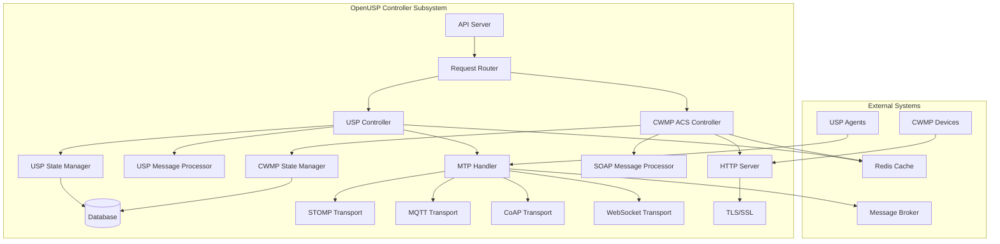

# Controller Subsystem Technical Architecture and Use Cases

This document provides a technical deep-dive into the OpenUSP Controller Subsystem, covering both TR-069 (CWMP) and TR-369 (USP) controller implementations.

## Table of Contents

- [Controller Architecture](#controller-architecture)
- [TR-069 ACS Controller](#tr-069-acs-controller)
- [TR-369 USP Controller](#tr-369-usp-controller)
- [Message Processing](#message-processing)
- [State Management](#state-management)
- [Protocol Specific Use Cases](#protocol-specific-use-cases)
- [Integration Patterns](#integration-patterns)

## Controller Architecture

### System Overview



### Core Components

#### 1. Request Router
- **Purpose**: Routes incoming requests to appropriate protocol handlers
- **Responsibilities**:
  - Protocol detection and routing
  - Load balancing between controller instances
  - Request validation and sanitization
  - Authentication and authorization

#### 2. Protocol Controllers
- **USP Controller**: Handles TR-369 USP protocol operations
- **CWMP ACS Controller**: Manages TR-069 CWMP device interactions

#### 3. Transport Abstraction Layer
- **Purpose**: Provides unified interface for different message transports
- **Supported Transports**: STOMP, MQTT, CoAP, WebSocket, HTTP/HTTPS

---

## TR-069 ACS Controller

### Architecture Components

```go
// CWMP ACS Controller structure
type CwmpACSController struct {
    httpServer    *http.Server
    soapProcessor *SOAPProcessor  
    sessionManager *CWMPSessionManager
    deviceRegistry *DeviceRegistry
    paramCache    *ParameterCache
    eventHandler  *CWMPEventHandler
    database      *Database
}
```

### Core Functions

#### 1. Session Management
```go
type CWMPSession struct {
    DeviceID        string
    SessionID       string
    State           SessionState
    LastActivity    time.Time
    PendingRequests []CWMPRequest
    DeviceInfo      DeviceInformation
}

// Session states
type SessionState int
const (
    SessionInitiated SessionState = iota
    SessionAuthenticated
    SessionActive  
    SessionTerminating
    SessionClosed
)
```

#### 2. SOAP Message Processing
```go
type SOAPProcessor struct {
    envelope    *SOAPEnvelope
    marshaller  XMLMarshaller
    validator   MessageValidator
}

// Key CWMP messages handled
type CWMPMessageType int
const (
    Inform CWMPMessageType = iota
    GetRPCMethods
    GetParameterNames
    GetParameterValues
    SetParameterValues
    Download
    Upload
    Reboot
    FactoryReset
)
```

### Use Case Implementation

#### Device Provisioning Flow
```go
func (acs *CwmpACSController) HandleInform(w http.ResponseWriter, r *http.Request) error {
    // 1. Parse INFORM message
    inform, err := acs.parseInformMessage(r.Body)
    if err != nil {
        return err
    }
    
    // 2. Authenticate device
    device, err := acs.authenticateDevice(inform.DeviceID)
    if err != nil {
        return err
    }
    
    // 3. Update device state
    err = acs.updateDeviceState(device, inform)
    if err != nil {
        return err
    }
    
    // 4. Check for pending configuration
    config, err := acs.getPendingConfiguration(device.ID)
    if err != nil {
        return err
    }
    
    // 5. Send configuration commands
    if config != nil {
        response := acs.buildConfigurationResponse(config)
        return acs.sendSOAPResponse(w, response)
    }
    
    return acs.sendInformResponse(w)
}
```

#### Parameter Management
```go
func (acs *CwmpACSController) SetParameters(deviceID string, params []Parameter) error {
    session := acs.sessionManager.GetSession(deviceID)
    if session == nil {
        return errors.New("no active session")
    }
    
    // Create SetParameterValues request
    request := &SetParameterValuesRequest{
        ParameterList: params,
        ParameterKey:  generateParameterKey(),
    }
    
    // Queue request for next device contact
    session.PendingRequests = append(session.PendingRequests, request)
    
    // Trigger connection request if needed
    if acs.shouldTriggerConnectionRequest(session) {
        return acs.sendConnectionRequest(deviceID)
    }
    
    return nil
}
```

### Specific Use Cases

#### 1. Bulk Firmware Update
- **Scenario**: Update firmware across thousands of devices
- **Implementation**:
  - Schedule downloads during off-peak hours
  - Implement staged rollout with success validation
  - Handle device reboot and re-provisioning
  - Track update status and retry failed devices

#### 2. Dynamic Service Configuration
- **Scenario**: Modify service parameters based on customer plan changes
- **Implementation**:
  - Receive service change notifications
  - Calculate required parameter modifications
  - Schedule configuration updates
  - Validate service activation

#### 3. Performance Monitoring
- **Scenario**: Collect device performance metrics
- **Implementation**:
  - Configure periodic parameter collection
  - Store metrics in time-series database
  - Generate performance alerts
  - Trigger automatic remediation

---

## TR-369 USP Controller

### Architecture Components

```go
// USP Controller structure
type USPController struct {
    mtpManager     *MTPManager
    msgProcessor   *USPMessageProcessor
    agentRegistry  *AgentRegistry
    subscriptions  *SubscriptionManager
    operationQueue *OperationQueue
    eventHandler   *USPEventHandler
    database       *Database
}
```

### Core Functions

#### 1. Message Transport Protocol (MTP) Management
```go
type MTPManager struct {
    transports map[string]Transport
    routes     *RoutingTable
}

type Transport interface {
    Send(endpoint string, message []byte) error
    Receive() (<-chan Message, error)
    Connect(config TransportConfig) error
    Disconnect() error
}

// Supported transports
type TransportType string
const (
    STOMP     TransportType = "stomp"
    MQTT      TransportType = "mqtt"
    CoAP      TransportType = "coap"
    WebSocket TransportType = "websocket"
)
```

#### 2. USP Message Processing
```go
type USPMessageProcessor struct {
    protobuf    *ProtobufHandler
    validator   *MessageValidator
    security    *SecurityManager
}

// USP Message types
type USPMsgType int
const (
    Get USPMsgType = iota
    GetResponse
    Set
    SetResponse
    Add
    AddResponse
    Delete
    DeleteResponse
    Operate
    OperateResponse
    Notify
    GetSupportedDM
    GetSupportedDMResponse
    GetInstances
    GetInstancesResponse
)
```

### Use Case Implementation

#### Multi-Controller Coordination
```go
func (usp *USPController) HandleMultiControllerScenario(agentID string, request *USPMessage) error {
    // 1. Check controller authority
    authority, err := usp.checkControllerAuthority(agentID, request.GetPath())
    if err != nil {
        return err
    }
    
    if !authority.HasPermission {
        // 2. Forward to appropriate controller
        return usp.forwardToController(authority.ControllerEndpoint, request)
    }
    
    // 3. Process request locally
    response, err := usp.processRequest(request)
    if err != nil {
        return err
    }
    
    // 4. Notify other controllers if needed
    if authority.RequiresNotification {
        usp.notifyOtherControllers(agentID, request, response)
    }
    
    return usp.sendResponse(agentID, response)
}
```

#### Event Subscription Management
```go
func (usp *USPController) HandleSubscription(agentID string, subscription *Subscription) error {
    // 1. Validate subscription parameters
    err := usp.validateSubscription(subscription)
    if err != nil {
        return err
    }
    
    // 2. Store subscription
    err = usp.subscriptions.Add(agentID, subscription)
    if err != nil {
        return err
    }
    
    // 3. Configure agent for event generation
    configRequest := &SetRequest{
        Parameters: []Parameter{
            {
                Path:  subscription.EventPath + ".Enable",
                Value: "true",
            },
        },
    }
    
    return usp.sendSetRequest(agentID, configRequest)
}
```

### Specific Use Cases

#### 1. IoT Device Orchestration
- **Scenario**: Coordinate multiple smart home devices
- **Implementation**:
  - Maintain device capability registry
  - Implement cross-device automation rules
  - Handle device state synchronization
  - Manage inter-device communication

#### 2. Edge Computing Management
- **Scenario**: Deploy and manage edge applications
- **Implementation**:
  - Container lifecycle management
  - Resource allocation and monitoring
  - Application deployment coordination
  - Network service chaining

#### 3. Real-time Service Adaptation
- **Scenario**: Dynamically adjust services based on conditions
- **Implementation**:
  - Monitor service quality metrics
  - Implement adaptive algorithms
  - Execute real-time reconfigurations
  - Maintain service continuity

---

## Message Processing

### CWMP SOAP Message Flow

```xml
<!-- INFORM Message from Device -->
<soap:Envelope>
    <soap:Header>
        <cwmp:ID soap:mustUnderstand="1">1234567890</cwmp:ID>
    </soap:Header>
    <soap:Body>
        <cwmp:Inform>
            <DeviceId>
                <Manufacturer>ExampleCorp</Manufacturer>
                <OUI>001122</OUI>
                <ProductClass>Router</ProductClass>
                <SerialNumber>SN123456</SerialNumber>
            </DeviceId>
            <Event>
                <EventStruct>
                    <EventCode>1 BOOT</EventCode>
                    <CommandKey></CommandKey>
                </EventStruct>
            </Event>
            <ParameterList>
                <ParameterValueStruct>
                    <Name>Device.DeviceInfo.SoftwareVersion</Name>
                    <Value>2.1.0</Value>
                </ParameterValueStruct>
            </ParameterList>
        </cwmp:Inform>
    </soap:Body>
</soap:Envelope>
```

### USP Protocol Buffer Message Flow

```protobuf
// USP Get Request
message Msg {
    Header header = 1;
    Body body = 2;
}

message Header {
    string msg_id = 1;
    MsgType msg_type = 2;
}

message Body {
    oneof msg_body {
        Request request = 1;
        Response response = 2;
        Error error = 3;
    }
}

message Request {
    oneof req_type {
        Get get = 1;
        Set set = 2;
        Add add = 3;
        Delete delete = 4;
        Operate operate = 5;
    }
}
```

---

## State Management

### Device State Tracking

#### CWMP Device State
```go
type CWMPDeviceState struct {
    DeviceID           string
    ConnectionState    ConnectionState
    LastInform         time.Time
    SoftwareVersion    string
    ParameterValues    map[string]string
    PendingOperations  []Operation
    SessionHistory     []SessionRecord
}
```

#### USP Agent State
```go
type USPAgentState struct {
    EndpointID         string
    ConnectionState    ConnectionState
    SupportedProtocols []string
    DataModel          *DataModelInfo
    Subscriptions      []Subscription
    OperationQueue     []Operation
    EventHistory       []Event
}
```

### Database Schema

```sql
-- CWMP Devices
CREATE TABLE cwmp_devices (
    device_id VARCHAR(255) PRIMARY KEY,
    manufacturer VARCHAR(100),
    product_class VARCHAR(100),
    serial_number VARCHAR(100),
    software_version VARCHAR(50),
    last_inform TIMESTAMP,
    connection_state ENUM('online', 'offline', 'unreachable'),
    created_at TIMESTAMP DEFAULT CURRENT_TIMESTAMP,
    updated_at TIMESTAMP DEFAULT CURRENT_TIMESTAMP ON UPDATE CURRENT_TIMESTAMP
);

-- USP Agents  
CREATE TABLE usp_agents (
    endpoint_id VARCHAR(255) PRIMARY KEY,
    agent_type VARCHAR(50),
    supported_protocols JSON,
    data_model_version VARCHAR(50),
    last_contact TIMESTAMP,
    connection_state ENUM('connected', 'disconnected', 'error'),
    created_at TIMESTAMP DEFAULT CURRENT_TIMESTAMP,
    updated_at TIMESTAMP DEFAULT CURRENT_TIMESTAMP ON UPDATE CURRENT_TIMESTAMP
);

-- Parameters (shared)
CREATE TABLE device_parameters (
    id BIGINT AUTO_INCREMENT PRIMARY KEY,
    device_id VARCHAR(255),
    parameter_path VARCHAR(512),
    parameter_value TEXT,
    parameter_type VARCHAR(50),
    last_updated TIMESTAMP DEFAULT CURRENT_TIMESTAMP,
    INDEX idx_device_param (device_id, parameter_path)
);
```

---

## Protocol Specific Use Cases

### TR-069 Advanced Scenarios

#### 1. Service Assurance Automation
```go
type ServiceAssuranceRule struct {
    TriggerCondition string  // e.g., "Device.Ethernet.Interface.1.Stats.ErrorsReceived > 1000"
    Actions          []Action
    Cooldown         time.Duration
}

func (acs *CwmpACSController) EvaluateServiceAssurance(deviceID string) {
    device := acs.deviceRegistry.Get(deviceID)
    
    for _, rule := range acs.serviceAssuranceRules {
        if acs.evaluateCondition(device, rule.TriggerCondition) {
            for _, action := range rule.Actions {
                acs.executeAction(deviceID, action)
            }
        }
    }
}
```

#### 2. Regulatory Compliance Monitoring
```go
type ComplianceCheck struct {
    RuleID      string
    Description string
    Parameters  []string
    Validator   func(values map[string]string) bool
}

func (acs *CwmpACSController) RunComplianceChecks(deviceID string) []ComplianceViolation {
    violations := []ComplianceViolation{}
    
    for _, check := range acs.complianceChecks {
        values := acs.getParameterValues(deviceID, check.Parameters)
        if !check.Validator(values) {
            violations = append(violations, ComplianceViolation{
                DeviceID: deviceID,
                RuleID:   check.RuleID,
                Details:  check.Description,
            })
        }
    }
    
    return violations
}
```

### TR-369 Advanced Scenarios

#### 1. Multi-Service Orchestration
```go
func (usp *USPController) OrchestrateCrossServiceOperation(services []ServiceDefinition) error {
    // 1. Build dependency graph
    graph := usp.buildDependencyGraph(services)
    
    // 2. Execute in topological order
    for _, batch := range graph.GetExecutionBatches() {
        results := make(chan OperationResult, len(batch))
        
        // 3. Execute batch in parallel
        for _, service := range batch {
            go func(s ServiceDefinition) {
                result := usp.executeService(s)
                results <- result
            }(service)
        }
        
        // 4. Wait for batch completion
        for i := 0; i < len(batch); i++ {
            result := <-results
            if result.Error != nil {
                return usp.handleOrchestrationFailure(result)
            }
        }
    }
    
    return nil
}
```

#### 2. Adaptive QoS Management
```go
type QoSPolicy struct {
    ServiceClass    string
    MinBandwidth    int
    MaxBandwidth    int
    PriorityLevel   int
    AdaptationRules []AdaptationRule
}

func (usp *USPController) AdaptQoS(agentID string, networkConditions NetworkConditions) error {
    policies := usp.getQoSPolicies(agentID)
    
    for _, policy := range policies {
        for _, rule := range policy.AdaptationRules {
            if rule.Condition.Evaluate(networkConditions) {
                adjustment := rule.CalculateAdjustment(networkConditions)
                err := usp.applyQoSAdjustment(agentID, policy.ServiceClass, adjustment)
                if err != nil {
                    return err
                }
            }
        }
    }
    
    return nil
}
```

---

## Integration Patterns

### 1. Event-Driven Architecture

```go
type EventBus struct {
    subscribers map[string][]EventHandler
    publisher   MessagePublisher
}

func (eb *EventBus) PublishDeviceEvent(event DeviceEvent) {
    for _, handler := range eb.subscribers[event.Type] {
        go handler.Handle(event)
    }
}

// Example event handlers
func (acs *CwmpACSController) HandleDeviceOfflineEvent(event DeviceEvent) {
    // Trigger connection request
    acs.sendConnectionRequest(event.DeviceID)
    
    // Log for monitoring
    acs.logger.Warn("Device went offline", "device_id", event.DeviceID)
    
    // Check if device needs immediate attention
    if acs.isHighPriorityDevice(event.DeviceID) {
        acs.escalateToSupport(event.DeviceID)
    }
}
```

### 2. Workflow Engine Integration

```yaml
# Example workflow definition
workflow:
  name: "device_provisioning"
  triggers:
    - type: "device_registration" 
      condition: "device.type == 'gateway'"
  
  steps:
    - name: "authenticate_device"
      action: "cwmp.authenticate"
      params:
        device_id: "${event.device_id}"
    
    - name: "get_device_capabilities"  
      action: "cwmp.get_parameters"
      params:
        device_id: "${event.device_id}"
        parameters: ["Device.DeviceInfo.*"]
    
    - name: "apply_service_config"
      action: "cwmp.set_parameters"
      params:
        device_id: "${event.device_id}"
        config_template: "${device.service_plan}"
    
    - name: "validate_configuration"
      action: "cwmp.validate_config"
      params:
        device_id: "${event.device_id}"
```

### 3. External System Integration

```go
// CRM Integration
type CRMIntegration struct {
    client     CRMClient
    controller *Controller
}

func (crm *CRMIntegration) HandleServiceChange(customerID string, newPlan ServicePlan) error {
    devices, err := crm.getCustomerDevices(customerID)
    if err != nil {
        return err
    }
    
    for _, device := range devices {
        config := crm.buildConfigurationFromPlan(device.Type, newPlan)
        
        switch device.Protocol {
        case "cwmp":
            err = crm.controller.CWMP.ApplyConfiguration(device.ID, config)
        case "usp":
            err = crm.controller.USP.ApplyConfiguration(device.ID, config)
        }
        
        if err != nil {
            crm.logConfigurationError(device.ID, err)
        }
    }
    
    return nil
}
```

This technical documentation provides a comprehensive understanding of how the OpenUSP Controller Subsystem handles both TR-069 and TR-369 protocols, enabling sophisticated device management scenarios across different deployment contexts.