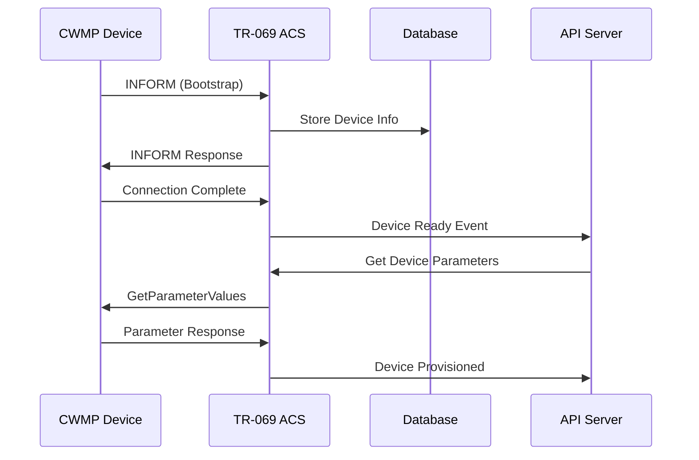
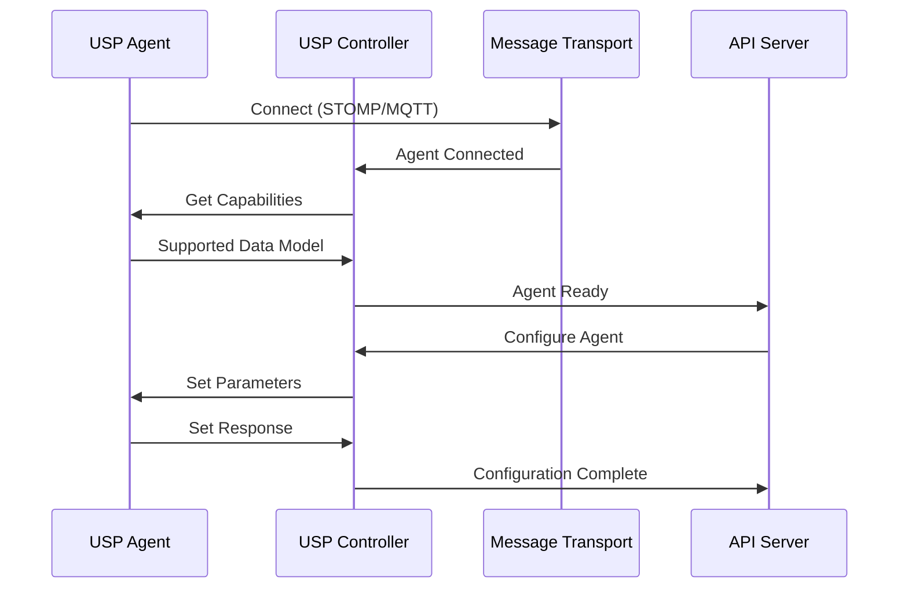

# OpenUSP Controller Subsystem Use Cases

This document outlines the comprehensive use cases for both TR-069 (CWMP) and TR-369 (USP) Controller subsystems in the OpenUSP platform.

## Table of Contents

- [Overview](#overview)
- [TR-069 (CWMP) Use Cases](#tr-069-cwmp-use-cases)
- [TR-369 (USP) Use Cases](#tr-369-usp-use-cases)
- [Comparative Analysis](#comparative-analysis)
- [Integration Scenarios](#integration-scenarios)
- [Implementation Examples](#implementation-examples)

## Overview

OpenUSP provides unified device management capabilities for both legacy TR-069 CWMP devices and modern TR-369 USP devices. This dual-protocol support enables service providers to manage their entire device ecosystem from a single platform.

### Protocol Comparison

| Aspect | TR-069 (CWMP) | TR-369 (USP) |
|--------|---------------|--------------|
| **Year Introduced** | 2004 | 2018 |
| **Transport** | HTTP/HTTPS + SOAP | Multiple (STOMP, CoAP, MQTT, WebSocket) |
| **Data Format** | XML | Protocol Buffers |
| **Security** | TLS + HTTP Auth | Enhanced security model |
| **Multi-Controller** | Single ACS | Multi-controller support |
| **Real-time** | Limited | Enhanced real-time capabilities |

---

## TR-069 (CWMP) Use Cases

### 1. Legacy Device Management

#### 1.1 Residential Gateway Management
- **Scenario**: Managing millions of deployed DSL/Cable modems and home gateways
- **Use Cases**:
  - Remote configuration of Wi-Fi settings (SSID, password, channel)
  - Firmware upgrade management across device fleets
  - Port forwarding and firewall rule configuration
  - Quality of Service (QoS) parameter tuning
  - Diagnostic data collection and troubleshooting

```bash
# Example: Configure Wi-Fi settings
curl -X POST -u admin:admin \
  -H "Content-Type: application/json" \
  -d '{
    "parameters": [
      {"name": "Device.WiFi.SSID.1.SSID", "value": "MyNetwork_5G", "type": "string"},
      {"name": "Device.WiFi.AccessPoint.1.Security.KeyPassphrase", "value": "SecurePassword123", "type": "string"}
    ]
  }' \
  http://localhost:8081/cwmp/device/gateway-001/params
```

#### 1.2 Set-Top Box Fleet Management
- **Scenario**: Managing cable/IPTV set-top boxes in subscriber homes
- **Use Cases**:
  - Software update distribution and scheduling
  - Channel lineup configuration
  - Parental control settings management
  - Usage statistics collection
  - Remote troubleshooting and diagnostics

#### 1.3 VoIP Equipment Management
- **Scenario**: Managing VoIP phones and adapters
- **Use Cases**:
  - SIP account provisioning and configuration
  - Codec preference settings
  - Network QoS configuration for voice traffic
  - Call routing and forwarding rules
  - Remote reboot and factory reset operations

### 2. Broadband Service Provisioning

#### 2.1 Automated Service Activation
- **Scenario**: Zero-touch provisioning of new broadband services
- **Use Cases**:
  - Automatic service plan configuration
  - Bandwidth limit enforcement
  - VLAN configuration for service isolation
  - DNS server assignment
  - Initial security policy deployment

#### 2.2 Service Plan Changes
- **Scenario**: Customer upgrades/downgrades internet service plans
- **Use Cases**:
  - Dynamic bandwidth adjustment
  - QoS policy updates
  - Feature enablement/disablement
  - Billing integration updates
  - Service validation testing

### 3. Network Monitoring and Diagnostics

#### 3.1 Performance Monitoring
- **Scenario**: Continuous monitoring of device and network performance
- **Use Cases**:
  - Internet speed test execution
  - Wi-Fi signal strength monitoring
  - Connection uptime tracking
  - Latency and packet loss measurement
  - Throughput analysis per device

#### 3.2 Fault Detection and Resolution
- **Scenario**: Proactive identification and resolution of network issues
- **Use Cases**:
  - Automatic detection of service degradation
  - Remote diagnostic command execution
  - Log file collection and analysis
  - Configuration backup and restore
  - Predictive maintenance based on performance trends

### 4. Security Management

#### 4.1 Vulnerability Management
- **Scenario**: Protecting devices from security threats
- **Use Cases**:
  - Security patch deployment
  - Firewall rule updates
  - Access control list management
  - VPN configuration for secure access
  - Intrusion detection system configuration

#### 4.2 Compliance Enforcement
- **Scenario**: Ensuring devices meet regulatory requirements
- **Use Cases**:
  - Password policy enforcement
  - Encryption standard compliance
  - Audit trail collection
  - Certificate management
  - Security baseline validation

---

## TR-369 (USP) Use Cases

### 1. Next-Generation Device Management

#### 1.1 Multi-Vendor Ecosystem Management
- **Scenario**: Managing diverse IoT devices from multiple vendors
- **Use Cases**:
  - Smart home device orchestration
  - Cross-vendor interoperability
  - Unified device lifecycle management
  - Multi-protocol gateway coordination
  - Edge computing device management

```bash
# Example: Manage smart home devices
curl -X POST -u admin:admin \
  -H "Content-Type: application/json" \
  -d '{
    "command": "Device.SmartHome.Thermostat.1.SetTemperature()",
    "arguments": {
      "Temperature": "72",
      "Mode": "Auto"
    }
  }' \
  http://localhost:8081/operate/cmd/os::smart-home-001/Device.SmartHome.Thermostat.1.SetTemperature()
```

#### 1.2 Software-Defined Networking (SDN)
- **Scenario**: Dynamic network function configuration
- **Use Cases**:
  - Virtual network function (VNF) management
  - Network slice configuration
  - Quality of experience (QoE) optimization
  - Dynamic service chaining
  - Network function virtualization (NFV) orchestration

### 2. Multi-Controller Architecture

#### 2.1 Distributed Management
- **Scenario**: Multiple service providers managing shared infrastructure
- **Use Cases**:
  - Multi-tenant device management
  - Controller federation and coordination
  - Service-specific controller assignment
  - Cross-controller communication
  - Delegated authority management

#### 2.2 Edge Computing Integration
- **Scenario**: Managing computing resources at network edge
- **Use Cases**:
  - Edge server provisioning and configuration
  - Container orchestration at the edge
  - Real-time application deployment
  - Resource allocation optimization
  - Latency-sensitive service management

### 3. Advanced IoT and Smart City Applications

#### 3.1 Smart City Infrastructure
- **Scenario**: Managing city-wide IoT deployments
- **Use Cases**:
  - Smart lighting system control
  - Traffic management system coordination
  - Environmental monitoring sensor management
  - Public Wi-Fi infrastructure management
  - Emergency response system integration

#### 3.2 Industrial IoT (IIoT)
- **Scenario**: Managing industrial automation and monitoring systems
- **Use Cases**:
  - Factory equipment monitoring and control
  - Supply chain tracking system management
  - Energy management system optimization
  - Predictive maintenance orchestration
  - Safety system coordination

### 4. Enhanced Security and Privacy

#### 4.1 Zero-Trust Architecture
- **Scenario**: Implementing zero-trust security models
- **Use Cases**:
  - Dynamic device authentication
  - Micro-segmentation implementation
  - Continuous security assessment
  - Threat response automation
  - Identity and access management

#### 4.2 Privacy-Preserving Analytics
- **Scenario**: Collecting insights while preserving user privacy
- **Use Cases**:
  - Anonymized usage pattern analysis
  - Federated learning implementation
  - Differential privacy mechanisms
  - Consent management automation
  - Data minimization enforcement

### 5. Real-Time Service Delivery

#### 5.1 Dynamic Service Provisioning
- **Scenario**: Real-time service adaptation based on conditions
- **Use Cases**:
  - Bandwidth allocation based on demand
  - Service quality adaptation
  - Emergency service prioritization
  - Load balancing optimization
  - Resource scaling automation

#### 5.2 Event-Driven Management
- **Scenario**: Reactive management based on device events
- **Use Cases**:
  - Automatic incident response
  - Performance threshold monitoring
  - Predictive analytics implementation
  - Workflow automation
  - Service level agreement (SLA) enforcement

---

## Comparative Analysis

### Deployment Scenarios

#### When to Use TR-069 (CWMP)
- **Legacy Infrastructure**: Managing existing deployed devices
- **Simple Requirements**: Basic configuration and monitoring needs
- **Regulatory Compliance**: Meeting established industry standards
- **Cost Sensitivity**: Leveraging existing investments
- **Mature Ecosystem**: Working with established vendor solutions

#### When to Use TR-369 (USP)
- **New Deployments**: Greenfield installations and upgrades
- **Complex Requirements**: Advanced automation and orchestration
- **Multi-Vendor Environment**: Heterogeneous device ecosystems
- **Scalability Needs**: Large-scale, distributed deployments
- **Innovation Requirements**: Cutting-edge features and capabilities

### Migration Strategies

#### Gradual Migration
- **Phase 1**: Deploy USP alongside existing CWMP infrastructure
- **Phase 2**: Migrate high-value use cases to USP
- **Phase 3**: Retire legacy CWMP devices over time
- **Benefits**: Risk mitigation, investment protection, gradual learning

#### Parallel Operation
- **Approach**: Run both protocols simultaneously
- **Use Cases**: Different device types, service tiers, customer segments
- **Benefits**: Best-of-both-worlds, flexibility, future-proofing

---

## Integration Scenarios

### 1. Hybrid Network Management

#### Scenario Description
Service provider managing both legacy CWMP devices and new USP-enabled equipment in the same network infrastructure.

#### Implementation Approach
```yaml
# Docker Compose configuration for hybrid deployment
services:
  openusp-controller:
    # USP controller for new devices
    image: n4networks/openusp-controller:latest
    
  openusp-cwmpacs:
    # TR-069 ACS for legacy devices
    image: n4networks/openusp-cwmpacs:latest
    
  openusp-apiserver:
    # Unified API for both protocols
    image: n4networks/openusp-apiserver:latest
```

#### Use Cases
- Unified dashboard for all devices
- Consistent policy enforcement
- Gradual device migration
- Service continuity during upgrades

### 2. Service Provider Multi-Tenant Environment

#### Scenario Description
Multiple service providers sharing infrastructure while maintaining service isolation.

#### Key Requirements
- Tenant isolation and security
- Service-specific configurations
- Billing and usage tracking
- Compliance and audit trails

#### Implementation Features
- Controller federation
- Multi-tenant data isolation
- Role-based access control
- Service-specific policies

### 3. Smart Building Management

#### Scenario Description
Comprehensive building automation integrating multiple systems and protocols.

#### Device Categories
- **HVAC Systems** (TR-069): Legacy building automation
- **Lighting Controls** (USP): Modern smart lighting
- **Security Systems** (Mixed): Cameras, access control
- **Energy Management** (USP): Smart meters, optimization

#### Benefits
- Unified management interface
- Cross-system automation
- Energy optimization
- Maintenance coordination

---

## Implementation Examples

### TR-069 Device Onboarding Flow



### USP Device Management Flow



### API Usage Examples

#### TR-069 Parameter Management
```bash
# Get device information
curl -u admin:admin http://localhost:8081/cwmp/device/gateway-001

# Set Wi-Fi configuration
curl -X POST -u admin:admin \
  -H "Content-Type: application/json" \
  -d '{
    "parameters": [
      {"name": "Device.WiFi.SSID.1.SSID", "value": "HomeNetwork", "type": "string"},
      {"name": "Device.WiFi.Radio.1.Channel", "value": "6", "type": "int"}
    ],
    "parameterKey": "wifi-config-001"
  }' \
  http://localhost:8081/cwmp/device/gateway-001/params

# Reboot device
curl -X POST -u admin:admin \
  -H "Content-Type: application/json" \
  -d '{"commandKey": "reboot-001"}' \
  http://localhost:8081/cwmp/device/gateway-001/reboot
```

#### USP Device Operations
```bash
# List USP agents
curl -u admin:admin http://localhost:8081/get/agents/

# Get parameters from USP device
curl -u admin:admin \
  http://localhost:8081/get/params/os::smart-home-001/Device.WiFi.

# Execute operation
curl -X POST -u admin:admin \
  -H "Content-Type: application/json" \
  -d '{
    "command": "Device.Reboot()",
    "arguments": {
      "Delay": "10"
    }
  }' \
  http://localhost:8081/operate/cmd/os::smart-home-001/Device.Reboot()

# Add object instance
curl -X POST -u admin:admin \
  -H "Content-Type: application/json" \
  -d '{
    "instances": [{
      "path": "Device.WiFi.AccessPoint.",
      "parameters": {
        "Enable": "true",
        "SSID": "GuestNetwork"
      }
    }]
  }' \
  http://localhost:8081/add/instances/os::smart-home-001/Device.WiFi.AccessPoint.
```

### Monitoring and Analytics

#### Performance Metrics Collection
```bash
# TR-069 device statistics
curl -u admin:admin \
  "http://localhost:8081/cwmp/device/gateway-001/params?parameters=Device.Ethernet.Interface.1.Stats.BytesSent,Device.Ethernet.Interface.1.Stats.BytesReceived"

# USP device performance data
curl -u admin:admin \
  http://localhost:8081/get/params/os::smart-home-001/Device.DeviceInfo.MemoryStatus
```

#### Event-Driven Automation
```json
{
  "trigger": {
    "type": "parameter_change",
    "parameter": "Device.WiFi.Radio.1.Stats.ErrorsSent",
    "threshold": "> 100"
  },
  "actions": [
    {
      "type": "reboot_device",
      "delay": "300"
    },
    {
      "type": "send_notification",
      "message": "High error rate detected, device rebooted"
    }
  ]
}
```

---

## Best Practices

### 1. Architecture Design
- **Separation of Concerns**: Use dedicated controllers for each protocol
- **API Gateway**: Unified API layer for consistent access
- **Event-Driven**: Implement reactive patterns for scalability
- **Security First**: Apply defense-in-depth principles

### 2. Migration Planning
- **Assessment**: Evaluate current device capabilities
- **Prioritization**: Start with high-impact, low-risk scenarios  
- **Testing**: Comprehensive testing in staging environments
- **Rollback**: Maintain ability to revert changes

### 3. Operational Excellence
- **Monitoring**: Comprehensive device and service monitoring
- **Automation**: Reduce manual intervention through automation
- **Documentation**: Maintain up-to-date operational procedures
- **Training**: Ensure team proficiency in both protocols

### 4. Performance Optimization
- **Caching**: Implement intelligent caching strategies
- **Batching**: Group operations for efficiency
- **Load Balancing**: Distribute load across multiple controllers
- **Resource Management**: Monitor and optimize resource usage

This comprehensive use case documentation provides a foundation for understanding when and how to leverage both TR-069 and TR-369 capabilities within the OpenUSP platform.